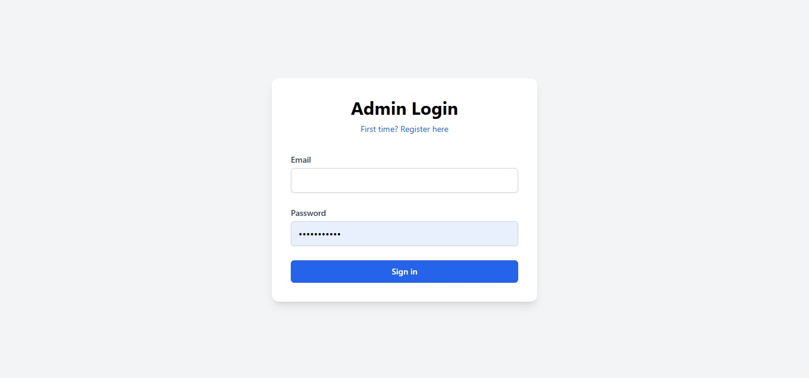
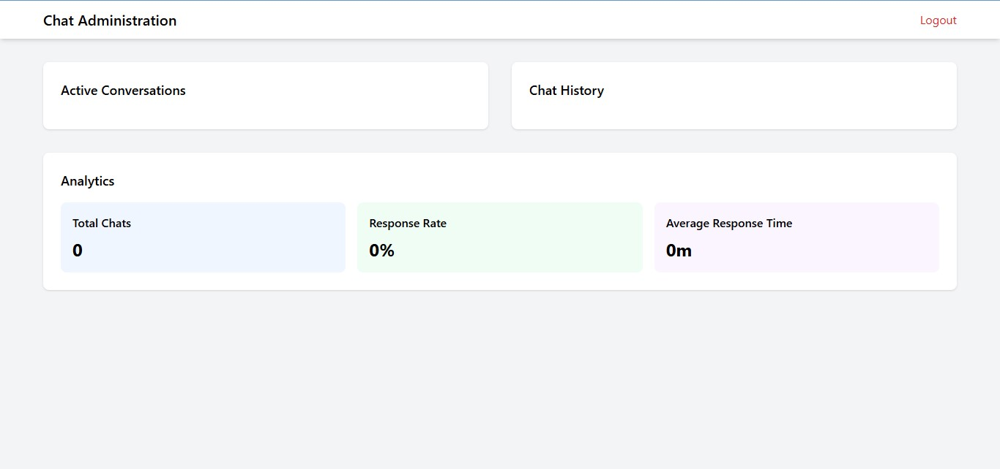

# Portfolio Website - Celyne Kydd

A modern, responsive portfolio website showcasing my skills and projects as a DevOps Engineer and FullStack Developer.

Live Demo: [Celyne's Portfolio](https://celyne-kydd-portfolio.onrender.com/)


## 🚀 Features

- **Responsive Design**: Fully responsive layout that works on desktop, tablet, and mobile devices
- **Dark Mode**: Toggle between light and dark themes
- **Project Showcase**: 
  - Detailed project pages with descriptions and links
  - Project filtering by category
  - Previous/Next navigation between projects
- **Interactive Elements**:
  - Custom cursor
  - Scroll progress bar
  - Back to top button
  - Animated section transitions
- **Contact Forms**:
  - Contact form integration with Formspree
  - Newsletter subscription functionality
- **Real-time Chat**: WebSocket-based chat widget
- **Blog Section**: Integration with LinkedIn articles
- **Performance Optimized**:
  - Lazy loading images
  - Efficient animations
  - Optimized asset delivery

## 🛠️ Technologies Used

- **Frontend**:
  - HTML5
  - CSS3 (with Tailwind CSS)
  - JavaScript (Vanilla)
  - AOS (Animate On Scroll)
  - Font Awesome Icons

- **Backend**:
  - Node.js
  - Express.js

- **Deployment**:
  - Render
  - Git

## 📁 Project Structure

```
ps/
├── Portfolio/
│   ├── assets/
│   │   ├── project_images/
│   │   ├── Resume.pdf
│   │   └── ...
│   ├── index.html
│   ├── projects.html
│   ├── project-details.html
│   ├── style.css
│   └── script.js
├── server.js
├── package.json
└── README.md
```

## 🚀 Getting Started

### Prerequisites
- Node.js (v18 or higher)
- npm (comes with Node.js)

### Installation

1. Clone the repository:
```bash
git clone https://github.com/mimi-netizen/MyPortfolio.git
cd portfolio
```

2. Install dependencies:
```bash
npm install
```

3. Start the development server:
```bash
npm start
```

4. Open http://localhost:3000 in your browser

## 🔧 Configuration

### Environment Variables
No environment variables are required for basic setup.

### Formspree Integration
The contact form uses Formspree. Update the form action URL in `index.html`:
```html
<form action="https://formspree.io/f/your-form-id" method="POST">
```

## 📱 Features in Detail

### Project Filtering
- Categories: DevOps, E-Commerce, Automation, Machine Learning, Web Development
- Real-time filtering with smooth animations
- Maintains state between page loads

### Dark Mode
- System preference detection
- Manual toggle option
- Persistent preference storage

### Responsive Design
- Mobile-first approach
- Breakpoints:
  - Mobile: < 768px
  - Tablet: 768px - 1024px
  - Desktop: > 1024px

## 🚀 Deployment

The site is deployed on Render. To deploy your own version:

1. Fork this repository
2. Create a new Web Service on Render
3. Connect your GitHub repository
4. Configure the deployment:
   - Build Command: `npm install`
   - Start Command: `npm start`
   - Node Version: 18

## 🛠️ Development

### Adding New Projects

1. Add project data to `projectsData` object in `script.js`:
```javascript
projectsData[id] = {
  title: "Project Name",
  category: "CATEGORY",
  image: "./assets/project_images/image.jpg",
  description: "Project description...",
  github: "https://github.com/...",
  website: "https://..."
};
```

2. Add project ID to `projectIds` array in `script.js`

### Customization

- Colors: Update Tailwind config in `index.html`
- Content: Modify HTML files directly
- Styling: Update `style.css`

## 👑 Admin Panel

### Access
- URL: `/admin/login.html`
- Default credentials:
  - Username: admin
  - Password: contact repository owner

  

  

### Features
- **Project Management**:
  - Add new projects
  - Edit existing projects
  - Delete projects
  - Toggle project visibility
  - Manage project categories

- **Content Management**:
  - Update about section
  - Manage testimonials
  - Edit LinkedIn article links
  - Update resume file

- **User Management**:
  - Change admin password
  - Add additional admin users
  - Manage user permissions

### Security
- Session-based authentication
- CSRF protection
- Rate limiting
- IP-based access restrictions

### Backup & Restore
```bash
# Backup projects data
npm run backup

# Restore from backup
npm run restore --file=backup_date.json
```

### API Documentation
Protected endpoints available at `/api/admin/`:
- `POST /api/admin/projects` - Create new project
- `PUT /api/admin/projects/:id` - Update project
- `DELETE /api/admin/projects/:id` - Delete project
- `POST /api/admin/users` - Manage users
- `POST /api/admin/content` - Update site content

### Logs
Admin actions are logged to:
```
/logs/admin_activity.log
/logs/security.log
/logs/errors.log
```

## 📄 License

This project is licensed under the MIT License - see the [LICENSE](LICENSE) file for details

## 📞 Contact

Celyne Kydd - [LinkedIn](https://linkedin.com/in/celyne-kydd) - [GitHub](https://github.com/mimi-netizen)

## 🙏 Acknowledgments

- Icons by Font Awesome
- Animations by AOS
- Deployment platform: Render
